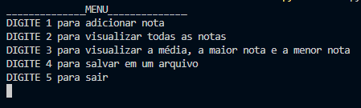
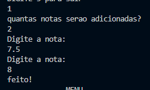
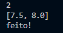
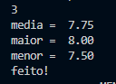
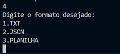
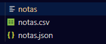

# menunotas
Sistema de Notas em python
> Para praticar comandos básicos!

### 1. "python menu.py" no terminal
### 2.  admire o menu

### 3. digite quantas notas serão adicionadas e adicione-as

### 4. visualize as notas que foram adicionadas

### 5. descubra a media, qual a maior e a menor nota

### 6. salve em arquivo, podendo escolher entre texto, json ou planilha.

 

